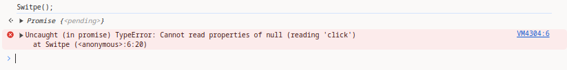
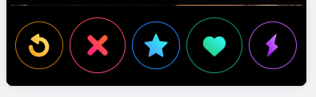
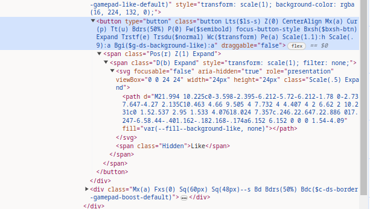
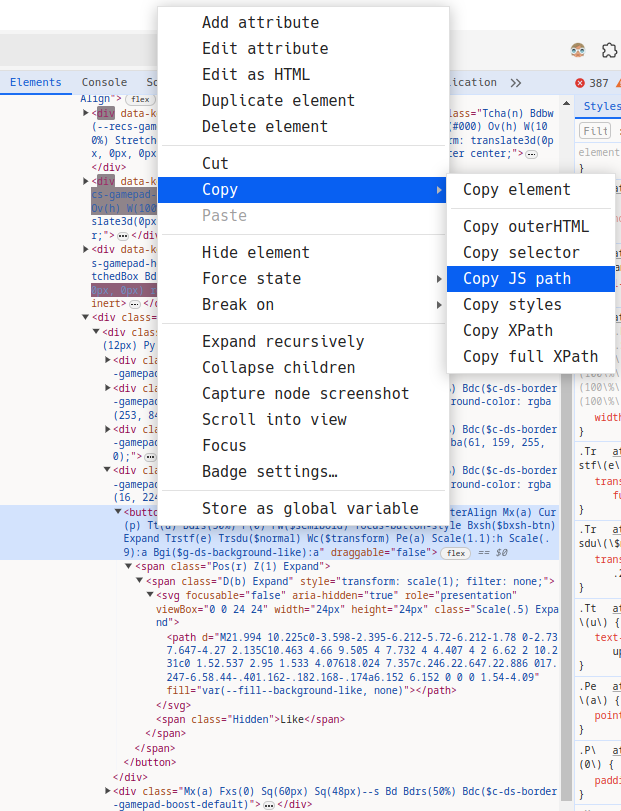

# Tinder likes bot using javascript

A simple JavaScript script to give likes on the dating app Tinder.

## Deployment

To deploy this project just need copy code and past on the console of navegator.

```JavaScript
var likeButton = document.querySelector("#u-1035653303 > div > div.App__body.H\\(100\\%\\).Pos\\(r\\).Z\\(0\\) > div > main > div.H\\(100\\%\\) > div > div > div.Mt\\(a\\).Px\\(4px\\)--s.Pos\\(r\\).Expand.H\\(--recs-card-height\\)--ml.Maw\\(--recs-card-width\\)--ml > div.recsCardboard__cardsContainer.H\\(100\\%\\).Pos\\(r\\).Z\\(1\\) > div > div.Pos\\(a\\).B\\(0\\).Iso\\(i\\).W\\(100\\%\\).Start\\(0\\).End\\(0\\) > div > div.Mx\\(a\\).Fxs\\(0\\).Sq\\(70px\\).Sq\\(60px\\)--s.Bd.Bdrs\\(50\\%\\).Bdc\\(\\$c-ds-border-gamepad-like-default\\) > button")

    async function Switpe() {
        for(let i=0; i<=1;i){
            await new Promise(resolve => setTimeout(resolve, 900));
            likeButton.click()
        }
    }

    Switpe();
```

## Common mistakes

If the script show errors similar to this:




do not worry about, it's common and easy to solved, go to the tinder web page and right click in like button:






after search the "button" tag over the selected tag and right click it, copy the JS path and replace it in code


```JavaScript
    var likeButton = //Ctrl + v
```

Copy and paste on console again.

## 🔗 Links
[](https://www.linkedin.com/in/alberto-vgs/)